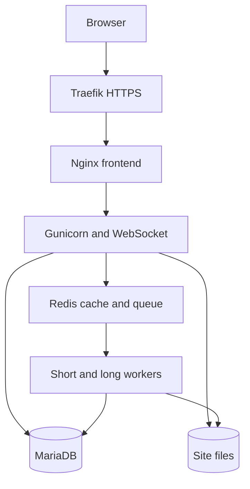

# Oracle Always Free ARM64 deployment

This kit deploys Northstar CRM as a complete Frappe v16 stack on one Oracle Cloud Ampere A1 VM. It is designed for a persistent demonstration or small UAT system, not a high-availability production CRM.

## What runs



All application processes use the same immutable `linux/arm64` image. Database, queue state, certificates, logs and site files use named volumes. Only ports 80 and 443 are public.

## 1. Publish the application image

Put this project in a GitHub repository. The included `build-arm64-image.yml` workflow calls Frappe's reusable image builder and publishes:

```text
ghcr.io/OWNER/northstar-crm:FULL_COMMIT_SHA
```

The commit-SHA tag makes deployments repeatable. For a public repository, make the container package public. For a private package, authenticate on the VM before deployment without saving a token in this project:

```bash
read -rsp "GitHub package token: " GHCR_TOKEN
echo
printf '%s' "$GHCR_TOKEN" | docker login ghcr.io -u YOUR_GITHUB_USER --password-stdin
unset GHCR_TOKEN
```

## 2. Create the free VM

In the Oracle Cloud console, create an Always Free eligible compute instance in the account's home region:

| Setting | Value |
|---|---|
| Image | Ubuntu, Always Free eligible |
| Shape | `VM.Standard.A1.Flex` |
| CPU and memory | 2 OCPUs, 12 GB RAM |
| Boot volume | 100 GB |
| Public IPv4 | Enabled |
| SSH | Your own public key |

The VCN security list or network security group must allow TCP 80 and 443 from the internet. Allow TCP 22 only from your own current public IP. Do not expose 3306, 6379, 8000, 8080 or 9000.

## 3. Bootstrap Ubuntu

Transfer or clone this repository onto the VM, enter this directory, and run:

```bash
chmod +x bootstrap-ubuntu.sh deploy.sh backup.sh
./bootstrap-ubuntu.sh
```

Log out and back in once after the bootstrap so Docker group membership is active.

## 4. Choose a free HTTPS hostname

If you own a domain, point an A record such as `crm.example.com` to the VM public IP and use that hostname.

For a demonstration without buying a domain, sslip.io resolves hostnames containing an IPv4 address. For public IP `203.0.113.10`, use:

```text
northstar.203.0.113.10.sslip.io
```

This is a third-party convenience DNS service. Use a domain you control before storing real customer information.

## 5. Initialize and deploy

Use the exact image tag from the successful GitHub Actions run:

```bash
./deploy.sh init \
  ghcr.io/OWNER/northstar-crm:FULL_COMMIT_SHA \
  northstar.203.0.113.10.sslip.io \
  admin@example.com

./deploy.sh apply
```

`init` creates a protected environment file plus random database-root and Administrator passwords. `apply` validates the Compose model, pulls the image, starts data services, creates or repairs the Frappe site, installs Northstar CRM, migrates it, enables the scheduler, and starts the HTTPS stack.

Open the reported HTTPS URL and sign in as `Administrator`. Display the generated password only when needed:

```bash
./deploy.sh password
```

Optionally populate a non-production site:

```bash
docker compose --env-file northstar.env -f compose.yaml exec backend \
  bench --site YOUR_SITE_NAME execute northstar_crm.install.seed_demo_data
```

## Operations

```bash
./deploy.sh status
./deploy.sh logs backend
./deploy.sh logs proxy
./backup.sh
```

To deploy a new immutable image, edit only `CUSTOM_IMAGE` in the mode-600 `northstar.env` file and rerun `./deploy.sh apply`. The installer reruns migrations before replacing application containers.

The private Docker network defaults to `172.31.250.0/24`. If that overlaps a network already present on the VM, change `DOCKER_SUBNET` before the first deployment.

`backup.sh` creates a full database plus public/private file backup and copies it outside the Docker volume. Move each backup to encrypted off-host storage. A backup retained only on this VM will be lost with the VM.

## Free-tier and security limits

- Oracle's useful Always Free compute is ARM64 and capacity can be unavailable in a region.
- Oracle may reclaim an Always Free instance that meets all documented low-utilization thresholds over seven days.
- A single VM has no redundancy or availability SLA.
- Oracle account enrollment and identity/card verification must be completed by the account owner. Never share an Oracle password or card details with a deployer.
- Confirm data residency, privacy, retention and breach-handling obligations before entering real customer data.
- Restrict SSH, patch Ubuntu and container images, test restores, monitor disk usage, and rotate credentials.

## Primary references

- [Oracle Always Free resources](https://docs.oracle.com/en-us/iaas/Content/FreeTier/freetier_topic-Always_Free_Resources.htm)
- [Frappe Docker custom-image build](https://github.com/frappe/frappe_docker/blob/main/docs/02-setup/02-build-setup.md)
- [Frappe Docker ARM64 guide](https://github.com/frappe/frappe_docker/blob/main/docs/01-getting-started/03-arm64.md)
- [Frappe Docker reusable image workflow](https://github.com/frappe/frappe_docker/blob/main/docs/08-reference/06-github-actions-image-workflows.md)
- [sslip.io hostname behavior and TLS](https://sslip.io/)
