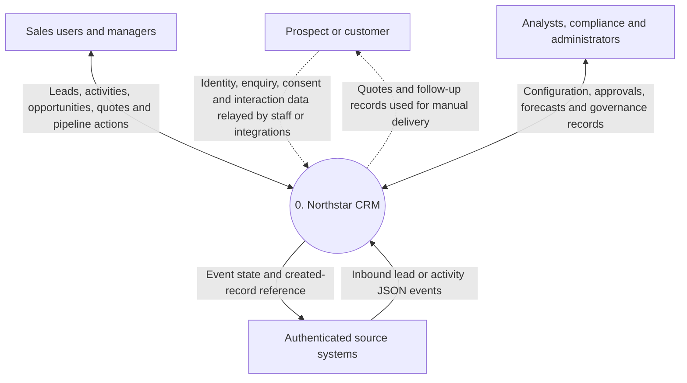
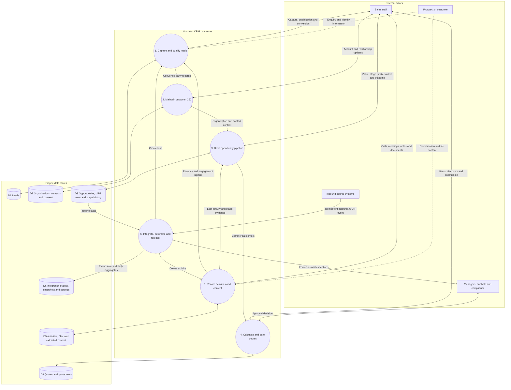
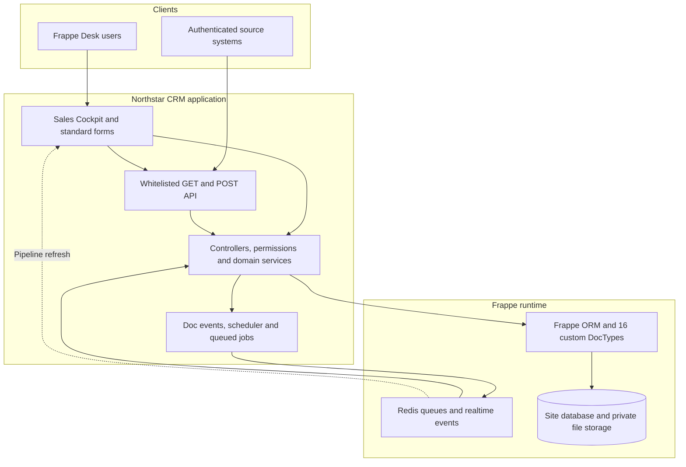
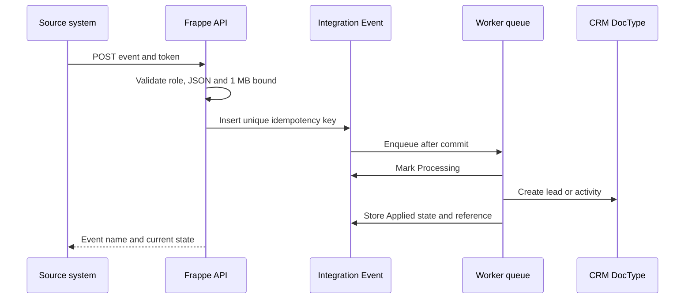

# System architecture and data-flow diagrams

## Architectural intent

Northstar CRM uses Frappe DocTypes as the transactional system of record, controllers for domain invariants, permission hooks for related-record row security, whitelisted methods for intentional frontend/integration operations, and Redis-backed workers for asynchronous extraction, integration handling, and scoring.

## DFD notation

| Shape | Meaning |
|---|---|
| Rectangle | External actor or system |
| Rounded process | Transformation performed by Northstar CRM |
| Cylinder | Persistent Frappe data store |
| Solid arrow | Implemented direct data flow |
| Dotted arrow | Indirect/manual flow in this release |

## DFD Level 0 — System context

The dotted customer flows are indirect. Northstar does not yet provide a customer portal, campaign sender, email delivery service, or electronic signature channel.

## DFD Level 1 — Implemented processes and stores

## Component architecture

## Runtime sequence — inbound integration event

## Implemented boundary and roadmap

| Implemented now | Extension roadmap |
|---|---|
| Lead capture, scoring, qualification and conversion | Campaigns, audience segments, journeys and attribution models |
| Organizations, contacts and consent evidence | Customer portal and preference center |
| Opportunities, stages, stakeholders, items and history | Territory hierarchy, team quotas and formal sales methodologies |
| Quote calculations and server-enforced discount approval | Generated PDFs, outbound delivery, e-signature and contracts |
| Calls, meetings, tasks, notes and transcripts | Calendar, email, telephony and messaging connectors |
| Text-file extraction, checksums and document search | PDF/Office extraction, OCR, transcription and semantic search |
| Two inbound event types and idempotency | Outbound webhooks, dead-letter handling and ERP synchronization |
| Forecast calculations and daily snapshots | FX normalization, scenarios, quotas and historical charts |
| Classification, retention, legal hold and consent status | Policy-driven disposal, subject-access workflows, DLP and SIEM export |
| Quote-to-activity audit events | Products, contracts, orders, invoices, payments, cases and renewals |
