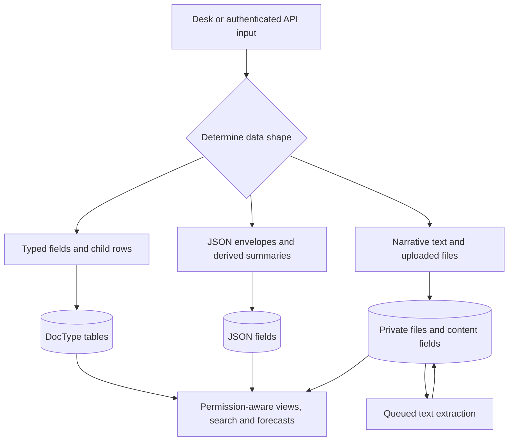
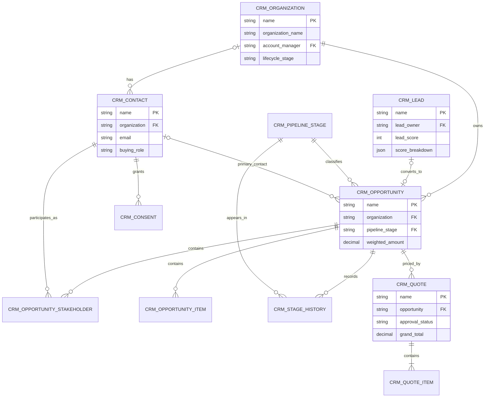
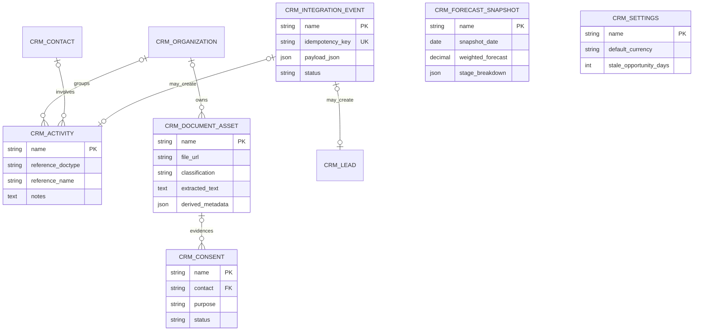
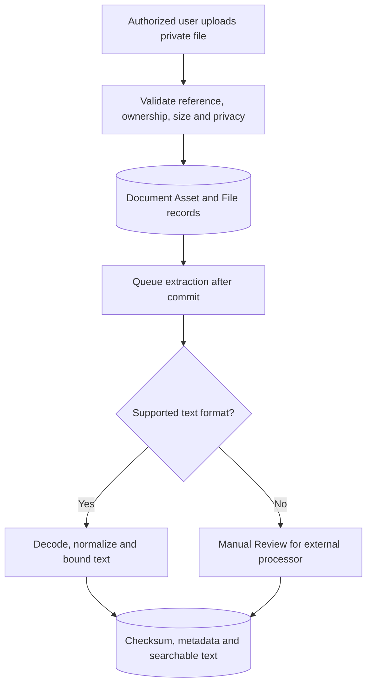

# Data model: structured and unstructured information

Northstar records two independent properties of information:

1. **Data shape** — structured, semi-structured, or unstructured.
2. **Sensitivity** — Public, Internal, Confidential, or Restricted.

A contract PDF, for example, is unstructured in shape and may be Restricted in sensitivity. A contact email is structured but still personal data. The concepts must not be mixed.

## Data-shape inventory

| Data shape | Implemented examples | Storage and processing | Main controls |
|---|---|---|---|
| Structured | Organizations, contacts, leads, stages, opportunities, stakeholders, items, quotes, consent, activities, stage history, snapshot metrics | Typed DocType columns, Link fields and relational child tables; controller validation; permission-aware ORM queries | Required fields, referential checks, numeric ranges, lifecycle rules, DocType permissions and related-record ownership |
| Semi-structured | Lead `score_breakdown`, integration `payload_json` and `response_json`, forecast `stage_breakdown`, document `derived_metadata` | JSON fields inside relational records; deterministic scoring/forecast outputs; versioned integration envelope | JSON-object validation, schema version, unique idempotency key, state machine, explicit supported event types and 1 MB API bound |
| Unstructured | Notes, email bodies, meeting summaries, call transcripts, deal context, quote terms, proposals, contracts, recordings and uploaded files | Text fields plus private Frappe `File` attachments; supported text files are extracted asynchronously into a bounded searchable field | Classification, PII indicator, private-file policy, size limit, SHA-256 checksum, content owner, retention date and legal hold |

## Data-shape flow

## Commercial core ER model

## Engagement and governance ER model

`CRM Activity`, `CRM Document Asset`, and `CRM Integration Event` use Dynamic Links because each may reference several CRM record types. Forecast snapshots and singleton settings are aggregate/configuration records rather than transactional children.

## DocType catalog

| DocType | Kind | Primary purpose | Dominant shape |
|---|---|---|---|
| CRM Organization | Master | Account identity, ownership, value and relationship health | Structured + narrative notes |
| CRM Contact | Master | Person, buying role and communication preference | Structured + narrative notes |
| CRM Lead | Transaction | Prospect qualification, score and conversion | Structured + score JSON |
| CRM Pipeline Stage | Configuration | Ordered probability and won/lost semantics | Structured |
| CRM Opportunity | Transaction | Deal pipeline, value, stakeholders, products and context | Structured + narrative context |
| CRM Opportunity Stakeholder | Child | Buying-committee membership | Structured |
| CRM Opportunity Item | Child | Opportunity product/service value | Structured |
| CRM Activity | Transaction | Interaction/task record and conversation content | Structured + unstructured text |
| CRM Consent | Governance | Purpose/channel permission evidence | Structured |
| CRM Document Asset | Governance | File catalog, classification and extraction | Structured + JSON + unstructured file/text |
| CRM Quote | Submittable transaction | Commercial offer and approval gate | Structured + unstructured terms |
| CRM Quote Item | Child | Priced line, discount and calculated total | Structured |
| CRM Stage History | Audit | Pipeline transition evidence and stage duration | Structured |
| CRM Forecast Snapshot | Aggregate | Daily management forecast record | Structured + breakdown JSON |
| CRM Integration Event | Operational | Idempotent inbound envelope and processing state | Structured + JSON |
| CRM Settings | Singleton configuration | Commercial, content and scoring policies | Structured |

## Unstructured-content pipeline

The application does not automatically delete expired content. `retention_until` and `legal_hold` provide governance evidence for a future organization-approved disposal workflow.
