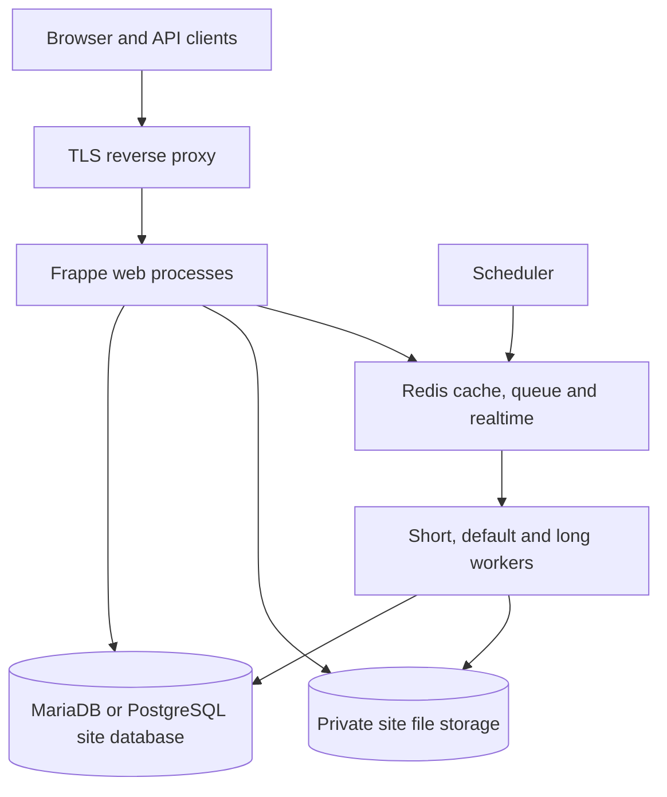
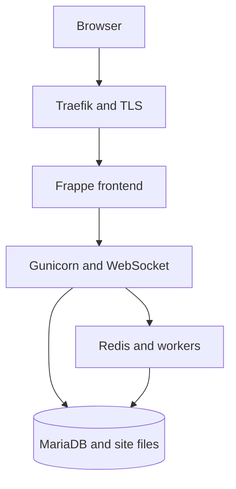

# Deployment and operations

## Reference topology



Northstar is a Frappe app, not a standalone static frontend. It needs a complete Frappe site and the normal database, Redis, worker, scheduler, realtime and asset-build services.

## Free-cloud reference deployment

The repository includes a reproducible single-VM deployment under [`deploy/oracle-arm64`](../deploy/oracle-arm64/README.md). It targets an Oracle Cloud Always Free Ampere A1 VM with Ubuntu and uses a custom `linux/arm64` Frappe v16 image.



The kit exposes only ports 80 and 443. MariaDB, Redis, backend and WebSocket ports remain on the private Docker network. It also provides idempotent site creation, migration on each image update, two queue workers, log rotation, persistent volumes, secret files, and a full site backup helper.

This no-cost single-node topology is suitable for demonstration or small UAT use. It has no high-availability SLA; customer data must not be used until regional privacy, backup, recovery, email, monitoring and incident-response requirements have been approved.

## Azure Container Apps image build

The project includes an Azure Container Registry remote-build path under
[`deploy/azure-container-apps`](../deploy/azure-container-apps/README.md).
It builds a Linux AMD64 Frappe v16 image with Northstar CRM installed, using
Azure Cloud Shell and ACR rather than a local Docker installation.

The image alone is not the full runtime. An Azure Container Apps deployment
still needs MariaDB, Redis cache and queue, frontend, backend, WebSocket,
workers, scheduler, and persistent site/database storage. Do not deploy the
image as a single standalone web container and treat that as a complete Frappe
installation.

## Install into an existing v16 Bench

```bash
cd /path/to/frappe-bench
bench get-app /absolute/path/to/frappe-northstar-crm
bench --site crm.example.test install-app northstar_crm
bench --site crm.example.test migrate
bench build --app northstar_crm
```

For local development:

```bash
bench start
```

For production, use the deployment method approved for the Frappe installation, then keep web, workers, scheduler, Redis, database and reverse proxy supervised.

## Initial configuration

1. Open `CRM Settings` as System Manager.
2. Confirm default/reporting currency, stale-days policy, discount approval threshold, score thresholds and content limits.
3. Assign roles to named users using least privilege.
4. Review each initial pipeline stage and its probability/won/lost behavior.
5. Verify private uploads and document download permissions.
6. Create a non-interactive integration user only if external event ingestion is required.
7. Optionally seed demo records in a non-production site.

## Queues and schedules

| Trigger | Work |
|---|---|
| After Document Asset commit | Long queue text extraction/checksum job |
| After Integration Event commit | Default queue inbound event processing |
| After Lead activity commit | Short queue score recalculation |
| Hourly | Refresh stale-opportunity flags |
| Daily | Recalculate open lead scores |
| Daily | Create company forecast snapshot |
| Daily | Mark consent expiring within 30 days |

Workers are designed to be retryable: integration events retain status and idempotency, and daily snapshot creation checks for an existing company/date record.

## Validation commands

```bash
bench --site crm.example.test migrate
bench --site crm.example.test run-tests --app northstar_crm
bench build --app northstar_crm
bench --site crm.example.test doctor
```

Also test the following with real non-administrator accounts:

- Sales User cannot list or open another owner's account tree.
- Analyst can report but cannot mutate commercial records.
- Compliance can access governed/restricted fields but cannot approve a quote.
- Integration User can submit an event but cannot use sales records interactively.
- Commercial quote changes return an approved quote to Pending.
- A duplicated idempotency key creates no duplicate lead/activity.
- Unsupported and oversized files/events fail or move to Manual Review as designed.

## Backup and recovery

Back up the site database and both public/private files using the Bench/platform method approved for the deployment. Encrypt backups, keep off-host copies, define retention, and regularly restore into an isolated site. A database-only restore is incomplete because Document Asset records refer to files.

## Upgrade sequence

1. Take a verified database and file backup.
2. Rehearse in staging with the target Frappe v16 release.
3. Run `bench update` according to the platform's controlled process.
4. Run site migration and app tests.
5. Rebuild assets and restart supervised services.
6. Verify roles, cockpit, queues, scheduled jobs, quote approvals and file access.

Do not move this app to Frappe v17 without testing and changing the dependency range in `pyproject.toml`.
