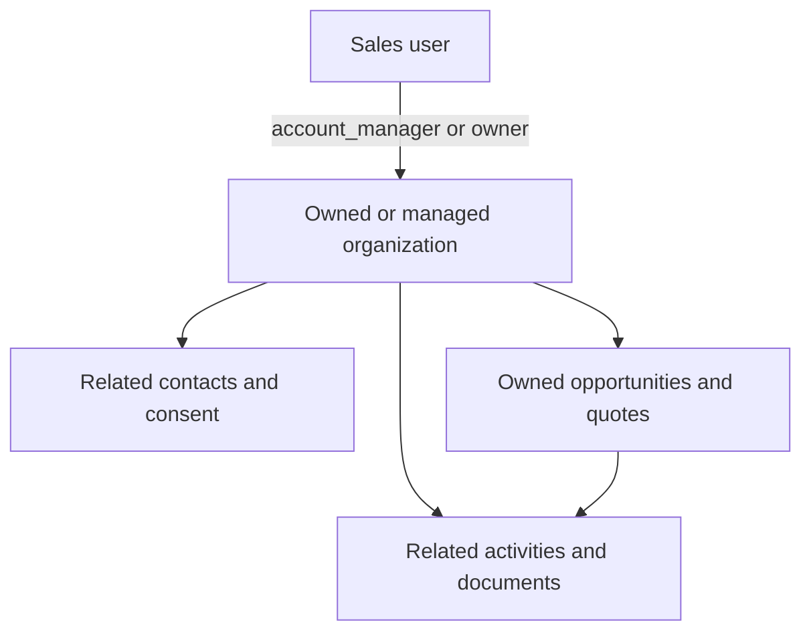

# Security and governance

## Control model

Northstar layers controls instead of relying on one role check:

1. Frappe authentication for Desk and API sessions.
2. Role permissions on every custom DocType.
3. Permission levels for restricted fields such as tax identifiers, legal hold, and internal commercial values.
4. Row-level permission query conditions for lists and reports.
5. Matching document-level permission hooks for direct record access.
6. Server-side relationship checks that prevent a newly created child/related record from pointing at an inaccessible account or deal.
7. Domain validation for financial ranges, quote approval, consent state, file privacy, and pipeline transitions.

## Role matrix

Exact permissions remain defined in each DocType JSON; this is the operational intent.

| Capability | Sales User | Sales Manager | Analyst | Compliance Manager | Integration User | System Manager |
|---|---:|---:|---:|---:|---:|---:|
| Assigned leads/accounts/deals | Create/read/write | Full | Read/report all | Selected read | No | Full |
| Related contacts/activities/files | Assigned-account scope | Full | Read/report all | Read/governed scope | No | Full |
| Quotes | Own-deal scope | Full and approve | Read/report | No | No | Full and approve |
| Restricted identity/content fields | No | Selected | No | Read/write by permission level | No | Full |
| Forecast snapshots | No direct administration | Read/report | Read/report | No | No | Full |
| Integration events | No | Read/report | Read/report | No | Create/read | Full |
| CRM Settings | No | Read | No | Read | No | Read/write |

## Ownership propagation

List/report access and direct document access use equivalent rules. This prevents an identifier guessed in a URL or API call from bypassing a list filter.

## Sensitivity classes

| Class | Example | Expected handling |
|---|---|---|
| Public | Published product brochure | Ordinary authenticated CRM use; may be eligible for public release after review |
| Internal | Account segmentation and non-sensitive operating notes | Employees with a business need |
| Confidential | Commercial proposals, detailed customer correspondence, forecasts | Restricted CRM roles; private files; controlled exports |
| Restricted | Identity evidence, tax identifiers, regulated records | Compliance/System Manager fields and strict organizational policy |

Classification is metadata, not encryption by itself. Production deployments should add infrastructure controls including TLS, database/file encryption, backup encryption, centralized logging, monitoring, vulnerability management, and tested disaster recovery.

## Quote approval integrity

- Discount and high-value approval thresholds are configured in `CRM Settings`.
- A server-side commercial SHA-256 signature covers parties, validity, terms, currency, tax, additional discount, and every item/rate/discount.
- Above-threshold quotes enter `Pending` automatically.
- Only Sales Manager or System Manager can approve/reject.
- Any commercial change generates a new signature and clears the earlier decision.
- Submission is blocked while Pending or Rejected.
- Every approval decision and submission produces a CRM Activity audit record.

The signature is a change detector, not a digital signature or non-repudiation mechanism.

## Integration controls

- Token/session authentication is provided by Frappe.
- `CRM Integration User` or `System Manager` is required at the inbound method.
- Payloads must be JSON objects and are limited to 1 MB.
- `idempotency_key` is unique and handles repeated delivery.
- Only two named event types are applied; unknown events move to Manual Review.
- Processing happens after the database transaction commits.
- Failures retain retry count and a safe operator message; detailed tracebacks go to the administrator-only Error Log.

Before internet exposure, place the endpoint behind rate limiting, a web application firewall/API gateway, source controls where appropriate, secret rotation, and alerting.

## Content controls

- Private attachments can be enforced globally.
- Upload size and extracted-text length are bounded in settings.
- File permission is checked before an attachment can become a searchable CRM asset.
- SHA-256 checksums identify content changes.
- Unsafe or unsupported formats are not parsed in-process; they move to Manual Review.
- `contains_pii`, classification, content owner, retention date, and legal hold are explicit governance metadata.

External OCR, Office/PDF parsing, antivirus, DLP, and audio transcription should run in isolated workers with file-type verification and resource limits.

## Production checklist

- Replace example publisher email and review branding metadata.
- Review all role memberships and remove unnecessary export/share rights.
- Keep integration accounts non-interactive and rotate API secrets.
- Confirm private-file behavior and test unauthorized downloads.
- Configure Frappe rate limits, TLS, trusted proxies, backups, monitoring and error retention.
- Add malware scanning before enabling broad file upload.
- Define retention/disposal policy and legal-hold authority before automating deletion.
- Add an FX source or enforce one currency before consolidated forecasts.
- Run permission tests using representative users, not only Administrator.
